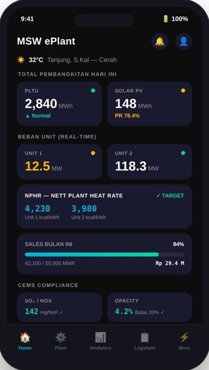

# MSW ePlant Mobile Application

<div align="center">



### **Enterprise Plant Monitoring & Warehouse Operations App**
**PT Makmur Sejahtera Wisesa (MSW) — Adaro Energy**  
*PLTU 2×30 MW CFPP + 1.3 MWp Solar PV Plant — Tanjung, Tabalong, Kalimantan Selatan*

[-02569B?logo=flutter)](https://flutter.dev)
[](pubspec.yaml)
[](plan/PRD_MSW_ePlant_v4.1.md)
[](android)
[](lib/services/d365_service.dart)

</div>

---

## 📌 1. Overview

**MSW ePlant** adalah aplikasi mobile enterprise internal PT Makmur Sejahtera Wisesa yang dirancang untuk mendukung operasional pembangkit, pemantauan performa real-time, pencatatan logsheet digital, pelacakan KPI/OKR, serta transaksi logistik & pergudangan material yang terintegrasi langsung dengan ERP **Microsoft Dynamics 365 (D365 SCM)**.

Aplikasi ini menggunakan tema gelap (*Dark Glassmorphism*) berlatar belakang visual pembangkit PLTU MSW (`asset/msw.png`), didukung tata letak responsif, navigasi berbasis peran pengguna (*Role-Based Access Control*), dan komunikasi data asinkron berkecepatan tinggi.

---

## 🚀 2. Fitur-Fitur Utama

### 🏭 1. Plant & Generation Real-Time Monitoring
- **Live Generation Streaming**: Menampilkan total gross generation (MW), net generation, beban auxiliary, serta distribusi beban ke jaringan PLN dan captive Adaro Indonesia (AI).
- **Unit 1 & Unit 2 Sensor Matrix**: Pemantauan real-time parameter kritis (Main Steam Pressure/Temp, Reheat, Drum Level, Vacuum Condenser, Generator MW/MVAR/Hz).
- **Trip & Shutdown Banner**: Deteksi otomatis status unit trip atau shutdown (beban < 2 MW) dengan banner peringatan visual.
- **Weather Widget**: Kondisi cuaca, suhu, kelembaban, dan kecepatan angin real-time di Tanjung, Tabalong via OpenWeatherMap API.

### 🍃 2. CEMS (Continuous Emission Monitoring System)
- **Multi-Pollutant Real-Time Tracking**: Pemantauan emisi Particulate Matter (PM), Sulfur Dioksida ($\text{SO}_2$), Nitrogen Oksida ($\text{NO}_x$), dan Merkuri ($\text{Hg}$) untuk Unit 1 & 2.
- **Baku Mutu Threshold & Compliance Badge**: Indikator status *Compliant* / *Exceeded* terhadap baku mutu regulasi PermenLHK / PTBAE-PU.
- **Interactive Threshold Chart**: Visualisasi tren emisi dengan garis batas (*HorizontalLine*) menggunakan `fl_chart`.
- **Local Alert Notifications**: Notifikasi otomatis saat parameter emisi mendekati atau melewati ambang batas toleransi.

### 📈 3. NPHR & Thermal Efficiency Analytics
- **Polynomial NPHR Curve**: Kurva efisiensi panas 5–30 MW dengan overlay titik kerja aktual real-time.
- **Target vs Actual Indicator**: Evaluasi deviasi konsumsi kalori batubara terhadap target efisiensi energi.
- **Multi-Parameter Charting**: Analisis korelasi multi-sensor dengan sumbu ganda (*Dual Y-Axis*).

### 📋 4. Digital Shift Logsheet
- **Boiler Logsheet**: 62 parameter operasi per time slot shift (07:00 – 19:00 WITA).
- **Steam Turbine Logsheet**: 57 parameter operasi (bearing temp, vibration, oil pressure, vacuum).
- **Direct Cloud Sync**: Sinkronisasi langsung ke Google Sheets master via OAuth2 Google API v4.
- **Offline Draft Saving**: Penyimpanan lokal sementara saat jaringan offline via `SharedPreferences`.

---

### 📦 5. Modul Warehouse & Pengambilan Material Multi-Item (D365 SCM) — *NEW in v4.3*

Modul mutakhir untuk kebutuhan pengambilan material/sparepart operasional yang terintegrasi langsung dengan ERP **Microsoft Dynamics 365**:

```
 ┌──────────────────────┐      ┌────────────────────────┐      ┌───────────────────────┐
 │   Warehouse Page     │ ───> │   Material Issue Form  │ ───> │  D365 ERP API Server  │
 │  - D365 Sesi Banner  │      │  - Header WO Picker    │      │  - On-Demand Check    │
 │  - Search Item D365  │      │  - Multi-Item Cart     │      │  - Journal No Issue   │
 │  - Riwayat Transaksi │      │  - Qty vs Stock Valid  │      │  - Real-time Stock    │
 └──────────────────────┘      └────────────────────────┘      └───────────────────────┘
            │                              ▲
            ▼                              │
 ┌──────────────────────┐                  │
 │  QR / Barcode Camera │ ─────────────────┘
 │  - Laser Viewfinder  │   (Scan Barcode / Input Manual)
 │  - Torch & Flip Cam  │
 └──────────────────────┘
```

#### ✨ Keunggulan & Fitur Warehouse:
1. **Otentikasi Akun D365 In-App (`D365UserSession`)**:
   - Login mandiri ke sistem D365 langsung di aplikasi.
   - Pilihan instan akun executor resmi: `61000003 - Executor EIC`, `61000006 - Executor DG-PLTS`, `61000002 - Executor MECH-W&F`.
   - Opsi input Employee ID dan PIN kustom untuk seluruh personil.
   - Status sesi tersinkronisasi otomatis dengan tombol cepat **`Login D365`**, **`Ganti`**, dan **`Logout`** di dashboard.
2. **Daftar Work Order (WO) Dinamis D365**:
   - Pemilihan WO aktif yang belum completed (`In Progress`, `Open`, `Released`).
   - Auto-fill data Activity, Cost Center, dan Gudang default sesuai WO terpilih.
3. **Master Data Resmi D365**:
   - **19 Gudang (Warehouse)**: `MAINSTORE`, `OILSTORE`, `CHEMSTORE`, `MAINWORK`, `COALSTORE`, `SAFETYSTORE`, dll.
   - **86 Activity Dimension Values**: `6100AC5403 - Equipment Tools`, `6100AC4042 - Inventory - Lubricant`, `6100AC0000 - NON`, dll.
   - **39 Cost Center Operating Units**: `6100DB401 - MSW_Maintenance - Mechanical`, `6100DB402 - EIC`, dll.
   - **Dynamic Unit Type**: Satuan barang (`PCS`, `SET`, `LTR`, `KG`, `UNIT`) diterima langsung secara dinamis dari D365.
4. **Arsitektur On-Demand Single Fetch**:
   - Pengecekan data barang dan sisa stok dilakukan secara instan per nomor item (`01.001.001.0004`) saat discan/diketik.
   - Respon sangat cepat (**< 200 ms**), ukuran payload sangat ringan (**< 1 KB**), dan stok dipastikan **100% akurat real-time**.
5. **Search Item D365 (Contains Filter)**:
   - Pencarian master katalog barang D365 berdasarkan kata kunci nama barang atau nomor item (daftar awal kosong sebelum dicari agar tidak membebani memori).
6. **Pemindai Barcode & QR Code (`mobile_scanner` v6.0.11)**:
   - Antarmuka kamera modern dengan animasi *laser scanning beam*, toggle senter (*torch*), *flip camera*, dan modal fallback input manual auto-format `XX.XXX.XXX.XXXX`.
7. **Formulir Pengambilan Multi-Item**:
   - Pengambilan beberapa sparepart sekaligus dalam 1 Work Order.
   - Validasi ketat kuantitas pengambilan tidak boleh melebihi sisa stok D365.
   - Review dialog & posting payload dengan format kode unit dan kode employee resmi D365.
   - Otomatis menerbitkan **Nomor Jurnal Transaksi D365** (contoh: `JRN-D365-2026-4821`).

---

### 🎯 6. OKR (Objectives & Key Results) Dashboard
- **Strategic Progress Tracking**: Monitoring progres sasaran strategis perusahaan tahun 2026.
- **In-App OKR Editor**: Penambahan, pengeditan, penghapusan, dan pembaruan nilai progres KR dengan proteksi password admin OKR.

### 🛡️ 7. HSE & Hazard Reporting
- Pelaporan potensi bahaya (*Unsafe Action / Unsafe Condition*) langsung dari lapangan.

### 🔐 8. Role-Based Access Control & Security
- **3 Peran Pengguna**: *Operation*, *Maintenance*, dan *General*.
- **Dynamic Bottom Navigation Bar**: Tab dan menu yang menyesuaikan peran yang sedang aktif.
- **Hierarki Keamanan Password**: Proteksi bertingkat untuk menu Admin, Pengaturan Password, dan Editor OKR.

---

## 🛠️ 3. Tech Stack & Dependencies

| Kategori | Teknologi / Library | Versi | Kegunaan |
|---|---|---|---|
| **Framework** | Flutter / Dart SDK | `^3.9.2` | Mobile UI cross-platform (Android, iOS) |
| **Realtime DB** | `firebase_core`, `firebase_database` | `^4.1.1`, `^12.0.2` | Streaming data sensor RTDB pembangkit |
| **ERP Integration**| `http`, `shared_preferences` | `^1.2.2`, `^2.2.3` | REST/OData D365 SCM API & Session State |
| **Barcode Scanner**| `mobile_scanner` | `^6.0.11` | Pemindai Barcode & QR Code kamera perangkat |
| **Chart & Visual** | `fl_chart` | `^1.1.1` | Grafik NPHR, tren emisi CEMS, dan analytics |
| **Date & Format**  | `intl` | `^0.19.0` | Lokalisasi tanggal, jam, dan angka desimal |
| **Sheets Sync**    | `googleapis`, `google_sign_in` | `^13.2.0`, `^6.2.1` | Sinkronisasi digital logsheet Google Sheets |
| **Local Notif**    | `flutter_local_notifications` | `^18.0.1` | Notifikasi alarm harian dan alert CEMS |
| **Icons & Style**  | `cupertino_icons` | `^1.0.8` | Ikonografi & desain konsisten |

---

## 📂 4. Struktur Direktori Proyek

```
msw_eplant/
├── android/                   # Konfigurasi native Android & AndroidManifest (Camera Permission)
├── asset/                     # Asset visual (msw.png, logo, background)
├── lib/
│   ├── constants/             # Token desain & AppColors (Dark Theme palette)
│   ├── models/                # Data models
│   │   ├── d365_user_model.dart       # Sesi login user D365 (Employee code, dept)
│   │   ├── material_issue_model.dart  # Payload transaksi pengambilan multi-item
│   │   ├── role.dart                  # UserRole model (Operation, Maintenance, General)
│   │   ├── warehouse_item.dart        # Model item katalog & stok D365
│   │   └── work_order_model.dart      # Model Work Order aktif D365
│   ├── pages/                 # Halaman & UI components
│   │   ├── analytics_page.dart        # Analisis korelasi multi-parameter
│   │   ├── cems_detail_page.dart      # Detail CEMS, compliance badge & threshold chart
│   │   ├── home_page.dart             # Dashboard utama, beban unit, cuaca, grid menu
│   │   ├── logsheet_page.dart         # Form logsheet Boiler & Turbine
│   │   ├── okr_page.dart              # Dashboard & editor OKR
│   │   ├── setting_page.dart          # Pengaturan, profil, dan admin password gate
│   │   └── warehouse/                 # Modul Warehouse D365
│   │       ├── material_issue_page.dart # Form pengambilan material multi-item
│   │       ├── qr_scanner_page.dart     # Kamera QR/Barcode scanner + viewfinder laser
│   │       └── warehouse_page.dart      # Dashboard gudang, Search Item, & Riwayat
│   ├── services/              # Business logic & API clients
│   │   ├── d365_service.dart          # Layanan lengkap integrasi D365 API & master data
│   │   ├── cems_threshold_service.dart# Pengawasan baku mutu emisi
│   │   ├── notification_service.dart  # Notifikasi lokal & peringatan alarm
│   │   └── rtdb_service.dart          # Stream listener Firebase RTDB
│   └── main.dart              # Entry point aplikasi & inisialisasi modul
├── plan/                      # Dokumen PRD, spesifikasi teknis, & mockup
│   ├── PRD_MSW_ePlant_v4.1.md         # Master Product Requirements Document (PRD v4.3)
│   └── Logsheet_Detail_Implementation.md
├── pubspec.yaml               # Definisi package & dependencies Flutter
└── README.md                  # Dokumentasi utama repositori
```

---

## 🧪 5. Data Dummy Nomor Item D365 (Siap Uji Simulasi)

Untuk simulasi pengambilan material, scan barcode, dan verifikasi stok, gunakan daftar nomor item berikut:

| Nomor Item (Format Scan / Input) | Nama Barang | Satuan (D365) | Sisa Stok | Lokasi Default |
|:---|:---|:---:|:---:|:---|
| `01.001.001.0004` | **BEARING 6204-2RS C3 SKF** | `PCS` | **24.0** | MAINSTORE / `RAK-A2 / BIN-04` |
| `01.001.001.0005` | **BEARING 6309-2Z/C3 SKF** | `PCS` | **12.0** | MAINSTORE / `RAK-A2 / BIN-05` |
| `01.002.001.0012` | **MECHANICAL SEAL TYPE B-35MM** | `SET` | **6.0** | MAINSTORE / `RAK-B1 / BIN-02` |
| `01.003.001.0001` | **SYNTHETIC GEAR OIL ISO VG 320** | `LTR` | **150.0** | OILSTORE / `LUBE-DRUM-03` |
| `01.004.001.0020` | **HEX BOLT M16 X 70MM SS316** | `PCS` | **80.0** | MAINSTORE / `RAK-C3 / BIN-11` |
| `01.005.001.0008` | **SPIRAL WOUND GASKET 3 INCH 150#** | `PCS` | **35.0** | MAINSTORE / `RAK-C1 / BIN-08` |
| `01.006.001.0002` | **PRESSURE TRANSMITTER 0-25 BAR** | `UNIT` | **4.0** | MAINWORK / `RAK-E1 / BIN-01` |
| `01.007.001.0015` | **OIL FILTER ELEMENT 10 MICRON** | `PCS` | **18.0** | MAINSTORE / `RAK-D2 / BIN-03` |
| `01.008.001.0003` | **MCB 3 POLE 32A 10KA SCHNEIDER** | `PCS` | **10.0** | MAINWORK / `RAK-E2 / BIN-05` |
| `01.009.001.0001` | **HIGH TEMP GREASE EP2** | `KG` | **45.0** | OILSTORE / `RAK-L1 / BIN-01` |

> *Catatan: Sistem juga mendukung pengujian nomor item kustom berformat `XX.XXX.XXX.XXXX` dengan kuantitas stok otomatis 15 PCS.*

---

## 💻 6. Panduan Menjalankan Aplikasi

### Prasyarat
- Flutter SDK `^3.9.2` atau lebih baru
- Android SDK (API level 21+) / Android Studio
- Device fisik Android dengan kamera (untuk scan QR/Barcode) atau Emulator

### Langkah Menjalankan:
```bash
# 1. Clone repository
git clone https://github.com/farhantandia/msw_eplant.git
cd msw_eplant

# 2. Unduh dependencies
flutter pub get

# 3. Verifikasi kode
flutter analyze

# 4. Jalankan pada perangkat yang terhubung
flutter run
```

---

## 📜 7. Riwayat Pembaruan (Changelog)

### **Update Terbaru (30 Agustus 2026 — Sejak Commit GitHub `51fd434`)**
- ➕ **Modul Warehouse D365 Terintegrasi**: Mengembangkan dashboard gudang [warehouse_page.dart](file:///lib/pages/warehouse/warehouse_page.dart) dengan banner status koneksi D365, quick actions, dan riwayat voucher.
- ➕ **Formulir Pengambilan Material Multi-Item**: Mengembangkan [material_issue_page.dart](file:///lib/pages/warehouse/material_issue_page.dart) yang mendukung pengambilan banyak item sekaligus per Work Order, dialog konfirmasi transaksi, dan validasi kuantitas stok real-time.
- ➕ **Otentikasi Akun D365 In-App**: Menambahkan model `D365UserSession` dan modal login D365 dengan pilihan akun executor resmi (`61000003`, `61000006`, `61000002`) serta input manual employee ID.
- ➕ **Integrasi Master Data D365**: Memasukkan 19 Gudang resmi, 86 Activity Dimension Values, 39 Cost Center Operating Units, dan dynamic unit type dari D365.
- ➕ **Pemindai Barcode & QR Code**: Membangun [qr_scanner_page.dart](file:///lib/pages/warehouse/qr_scanner_page.dart) dengan `mobile_scanner` v6.0.11, animasi laser beam, toggle senter, dan switch kamera.
- ➕ **Arsitektur On-Demand Single Fetch**: Optimalisasi pengambilan data katalog & stok secara on-demand per nomor item untuk efisiensi tinggi (< 200ms latency, < 1 KB payload).
- ➕ **Pencarian Master Barang (Search Item D365)**: Menambahkan modal pencarian barang berbasis filter nama/kata kunci dengan list awal kosong sebelum dicari.
- ➕ **Izin Kamera Native Android**: Menambahkan izin `<uses-permission android:name="android.permission.CAMERA"/>` pada `AndroidManifest.xml`.
- ➕ **Dokumentasi Lengkap**: Memperbarui PRD ke Versi 4.3 dan menyusun master `README.md`.

---

<div align="center">
<b>© 2026 PT Makmur Sejahtera Wisesa (MSW) — Adaro Energy. All Rights Reserved.</b>
</div>
