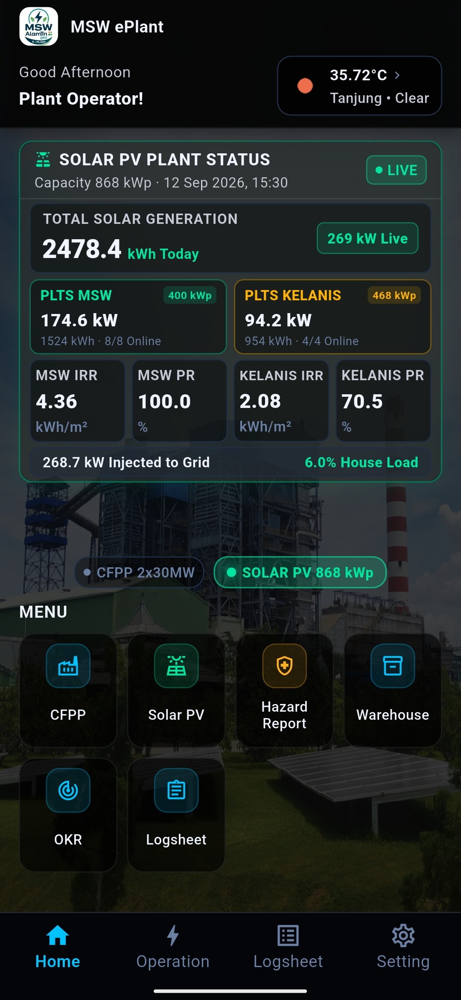
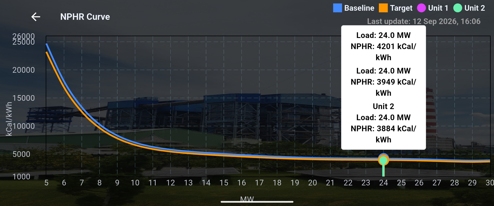
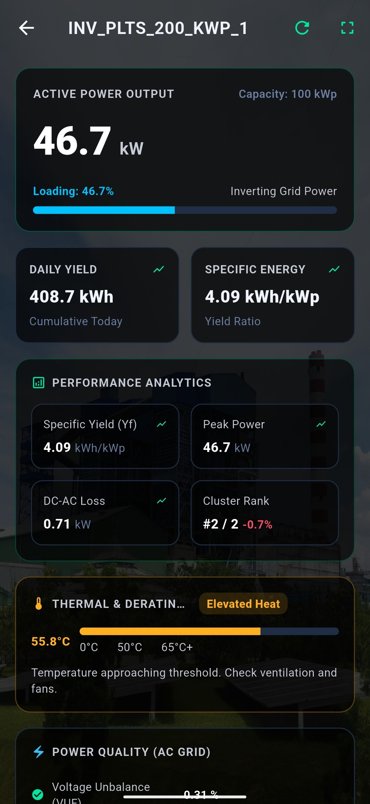
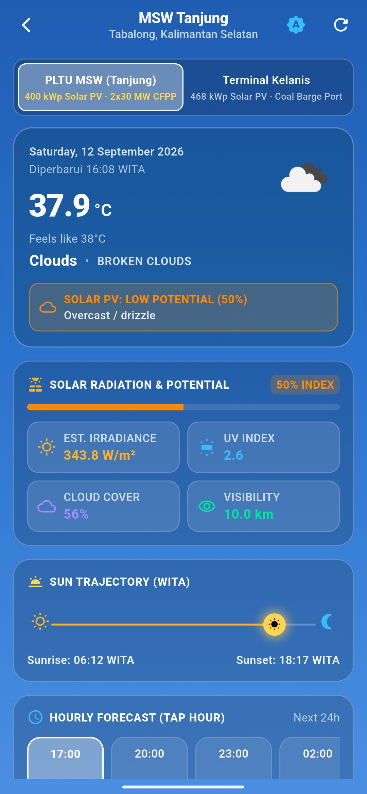
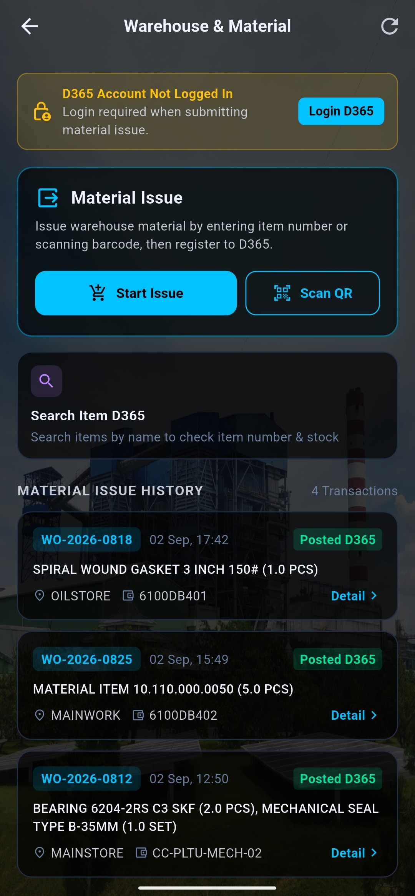
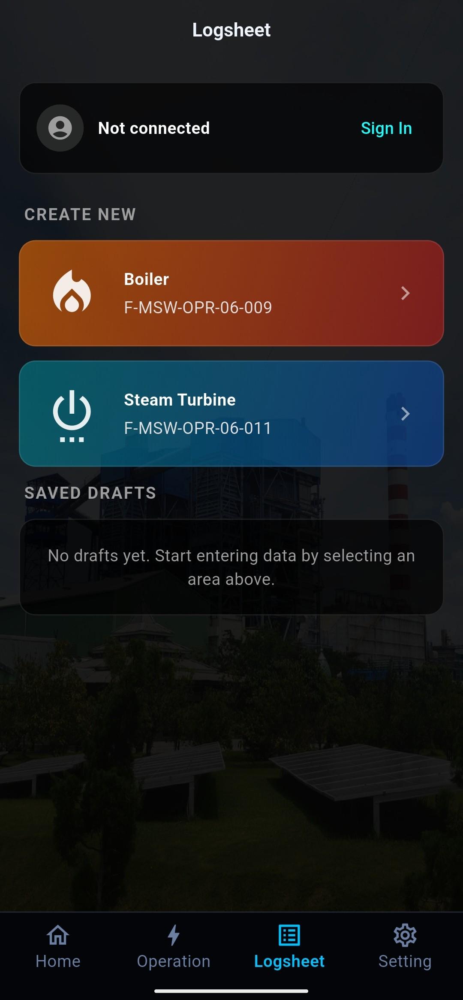
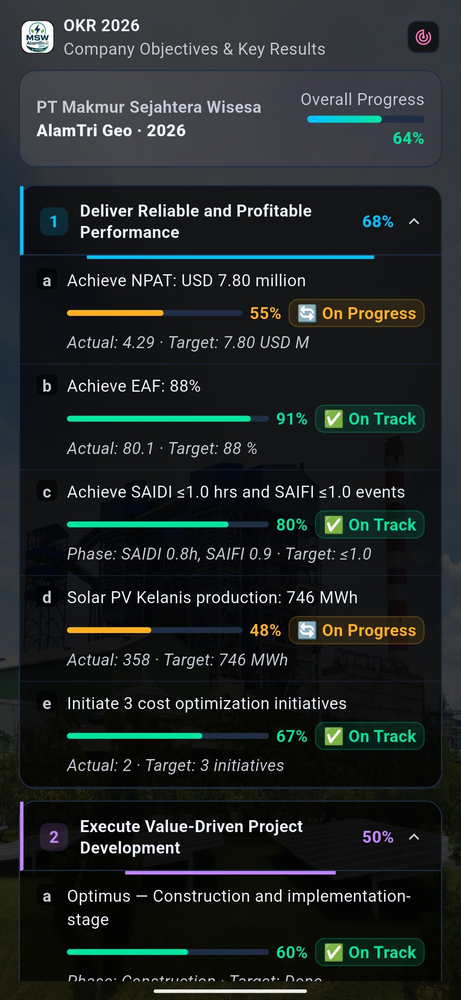
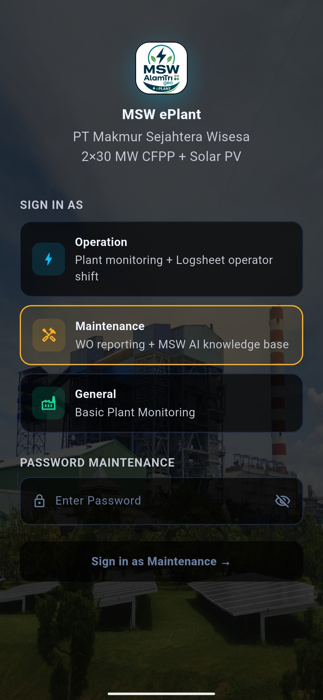

# MSW ePlant Mobile Application

<div align="center">

### **Enterprise Plant Monitoring & Warehouse Operations App**
**PT Makmur Sejahtera Wisesa (MSW) — Adaro Energy Solutions**  
*2×30 MW CFPP + 868 kWp Solar PV Plant — Tanjung, Tabalong, South Kalimantan, Indonesia*

[-02569B?logo=flutter)](https://flutter.dev)
[](pubspec.yaml)
[](docs/PRD_MSW_ePlant_v4.7.md)
[](android)
[](lib/services/d365_service.dart)
[](lib/services/fusion_solar_service.dart)
[](docs/FITUR_DAN_ROADMAP_MSW_EPLANT.md)

</div>

---

## 📌 1. Overview

**MSW ePlant** is an enterprise internal mobile application engineered for PT Makmur Sejahtera Wisesa (MSW). It empowers power plant operations with real-time performance telemetry, digital shift logsheet recording, corporate OKR/KPI tracking, and end-to-end warehouse material issuance integrated directly with **Microsoft Dynamics 365 Supply Chain Management (D365 SCM)** ERP and **Huawei FusionSolar OpenAPI**.

The application is built with a modern **Dark Glassmorphism** design system over the plant background visual (`asset/msw.png`), featuring responsive layouts, Role-Based Access Control (RBAC), and high-throughput asynchronous data streams.

---

## 📱 2. Visual Interface & Application Gallery

<div align="center">

### ⚡ 2.1 Central Plant Monitoring & SCADA Telemetry
<table>
  <tr>
    <td align="center" width="25%">
      <br />
      <b>Homepage Dashboard</b><br />
      <sub>Real-time Gross Load, Weather, Plant Status, Quick Cards & Navigation Grid</sub>
    </td>
    <td align="center" width="25%">
      <br />
      <b>Plant Overview (SCADA Flow)</b><br />
      <sub>Vector Single-Line Diagram, Busbar 20kV/70kV & Auxiliary Particle Flow</sub>
    </td>
    <td align="center" width="25%">
      <br />
      <b>CFPP Operational Overview</b><br />
      <sub>14 Central Overview Metrics: Gross MW, TMGCR, BMCR, EAF, CF & House Load</sub>
    </td>
    <td align="center" width="25%">
      <br />
      <b>Boiler & Turbine Detail</b><br />
      <sub>Main Steam Temp/Pressure, Feedwater, Drum Level, Air Flows & Feeders</sub>
    </td>
  </tr>
</table>

### 📈 2.2 Thermal Efficiency & Polynomial NPHR Curves (Landscape Analysis)
<table>
  <tr>
    <td align="center">
      <br />
      <b>Net Plant Heat Rate (NPHR) Landscape Curve (5–30 MW)</b><br />
      <sub>Real-time generation operating points mapped against 6th-order polynomial benchmark curve</sub>
    </td>
  </tr>
</table>

### ☀️ 2.3 Solar PV Renewable Energy & Meteorological Evaluation
<table>
  <tr>
    <td align="center" width="33%">
      <br />
      <b>Solar PV Dual-Plant Portal</b><br />
      <sub>PLTS MSW (400 kWp) & Kelanis (468 kWp) Generation, PR & Hourly Curves</sub>
    </td>
    <td align="center" width="33%">
      <br />
      <b>Huawei Inverter Diagnostics</b><br />
      <sub>SUN2000 3-Phase AC/DC Voltage, Current, Frequency, Temp & Alarms</sub>
    </td>
    <td align="center" width="33%">
      <br />
      <b>Weather & Solar Potential</b><br />
      <sub>OpenWeatherMap Live Ambient Data, 5-Day Forecast & Plant Risk Matrix</sub>
    </td>
  </tr>
</table>

### 📦 2.4 Enterprise Logistics, Digital Operations & Governance
<table>
  <tr>
    <td align="center" width="25%">
      <br />
      <b>Warehouse SCM (D365)</b><br />
      <sub>Multi-Item Material Cart, Work Order Picker & Stock Validation</sub>
    </td>
    <td align="center" width="25%">
      <br />
      <b>Digital Shift Logsheet</b><br />
      <sub>Hourly Parameter Logging & Cloud Google Sheets OAuth2 Sync</sub>
    </td>
    <td align="center" width="25%">
      <br />
      <b>Strategic OKR Dashboard</b><br />
      <sub>Corporate Strategy, Key Results & Audit Trail Tracking</sub>
    </td>
    <td align="center" width="25%">
      <br />
      <b>Role Selection & Security</b><br />
      <sub>Role-Based Access Control (RBAC) & Dynamic Passwords</sub>
    </td>
  </tr>
  <tr>
    <td align="center" colspan="4">
      <br />
      <b>Role PIN Verification Modal</b><br />
      <sub>Secure PIN Authentication Dialog for Protected Operations & Engineering Roles</sub>
    </td>
  </tr>
</table>

</div>

---

## 🚀 3. Key Features

### ⚡ 1. Plant Overview Detail & Animated SCADA Flow (Busbar 20kV / 70kV)
- **Centralized Firebase Node (`/excel_data/overview`)**: Aggregates 14 general plant and operational rating parameters:
  - `UNIT 1/2 TMGCR` (30 MW rating)
  - `UNIT 1/2 BMCR` (130 t/h steam capacity)
  - `UNIT 1/2 BOILER EFFICIENCY` (%)
  - `UNIT 1/2 EAF` (%) & `UNIT 1/2 CAPACITY FACTOR` (%)
  - `LOAD TO PLN` (MW), `LOAD TO AI` (MW), `TOTAL LOAD` (MW), `TOTAL HOUSE LOAD` (MW)
- **Zero Hardcoded Data Guarantee**: 100% dynamic telemetry streaming from Firebase RTDB nodes (`overview`, `table1`, `table2`, `cems1`, `cems2`, `nphr`). If any parameter is absent, the UI presents an elegant `" — "` placeholder, never displaying fictitious or hardcoded values. Includes seamless backward-compatible fallback to `table1`/`table2`.
- **Animated Single-Line SCADA Flow Diagram (`PlantEnergyFlowWidget`)**:
  - Custom Flutter vector rendering (`CustomPainter`) illustrating active power flow.
  - **Electrical Architecture & Flow Routing**: Unit 1 & Unit 2 Turbogenerators generate power at **11 kV**. Commercial export power is stepped up to the **`BUSBAR 20kV / 70kV`**, evacuating power to the **PLN 70 kV Grid** transmission line and **PT Adaro Indonesia (AI) 20 kV Industrial Dedicated Feeder**. Concurrently, auxiliary power is tapped directly from the 11 kV generator bus through **`Trafo 11kV / 6.6kV` (Unit Auxiliary Transformer)** feeding the internal **House Load (6.6 kV)**.
  - **Dynamic Particle Pulses**: Animated particle pulses travel along conductor paths at speeds proportional to power generation: cyan pulses for PLN 70kV export, amber pulses for PT AI 20kV feeder, and emerald green pulses for Trafo 11kV/6.6kV auxiliary flow (halting dynamically when a unit trips or shuts down).
  - **Interactive Node Inspection**: Tapping any node (Unit 1 & 2, Busbar 20kV/70kV, Trafo 11/6.6kV, PLN Grid, PT AI Feeder, House Load) opens an informative technical specification modal displaying voltage rating, actual active load, installed capacity, and real-time status.
- **Interactive Historical Trend (`ChartPage`) for All Telemetry Metrics**:
  - **Full Interactivity**: Every single telemetry card, metric cell, capability parameter, and environmental indicator on the Plant Overview page is interactive and can be tapped to launch `ChartPage`:
    - **Hero Balance Cards**: Total Gross Generation (MW), PLN Grid Export (MW), AI Feeder Export (MW), Auxiliary House Load (MW).
    - **Unit Operating Cards**: Unit 1 & Unit 2 Gross Loads (MW) with dedicated trend shortcuts.
    - **Unit Capability Matrix**: Unit 1 & Unit 2 TMGCR (MW), BMCR (T/h), Boiler Efficiency (%), EAF (%), Capacity Factor (%), and NPHR Heat Rate (kCal/kWh).
    - **CEMS 4 Environmental Indicators**: Unit 1 & Unit 2 SO₂, NOₓ, PM, and CO with regulatory threshold lines.
    - **Energy Flow Diagram Nodes**: Tapping any node in the SCADA flow diagram (Unit 1, Unit 2, Busbar 20kV/70kV, Trafo 11/6.6kV, PLN, AI, House Load) opens technical inspection with an `"OPEN HISTORICAL TREND"` button launching `ChartPage`.
    - **Fullscreen Trend Action**: Direct `"Full Chart"` button in the trend chart header to expand any selected telemetry tab to full screen.
- **Executive Dashboard PNG Image Sharing (`DashboardShareService`)**:
  - 1-Tap high-definition PNG capture (2.5x pixel ratio) of the complete Plant Overview executive dashboard.
  - Shares directly to WhatsApp, Telegram, Email, or Slack via native OS share sheet using `share_plus` and `path_provider`, complete with theme styling and glowing indicators.
- **Intelligent Unit Operating Conditions**: Dynamic health indicators for Unit 1 & 2:
  - 🟢 **Normal Running** ($\ge 12.0$ MW): Glowing status dot and full operational metrics.
  - 🟡 **Low Load** ($4.0 - 12.0$ MW): Advisory status for low-load combustion conditions.
  - 🟣 **House Load** ($0.0 - 4.0$ MW): Islanded auxiliary supply mode.
  - 🔴 **Shutdown / Trip** ($\le 0.0$ MW): Critical warning banner and deactivated particle flow.
  - Dynamic loading ratio against TMGCR capacity (e.g., $28.5\text{ MW} / 30.0\text{ MW} = 95.0\%$).
- **CEMS 4 Main Parameters Strip**: Real-time stack emissions for $\text{SO}_2$, $\text{NO}_x$, Particulate Matter (PM), and $\text{CO}$ with Permen LHK No. P.15/2019 regulatory badges and direct shortcut to `CemsDetailPage`.
- **Interactive Multi-Metric Trend Chart**: Touch-responsive `fl_chart` with 4 metric switcher chips (Load & House Load, PLN vs AI, Boiler Efficiency, and NPHR Heat Rate), custom tooltips, gradient underfills, and zero layout overflow across all mobile screens.

### 🏭 2. CFPP Homepage Direct Shortcut (*NEW in v4.6*)
- **MenuGrid Button Update**: Replaced generic "Plant" button with official **"CFPP"** (*Coal-Fired Power Plant*) branding.
- **Direct 1-Tap Routing**: Clicking "CFPP" routes directly to [PlantOverviewDetailPage](file:///lib/pages/plant/plant_overview_detail_page.dart), eliminating extra navigation steps and immediately surfacing comprehensive plant balance, SCADA single-line diagram, capability matrix, and emissions overview.

### ☀️ 3. Solar PV Dual-Plant (868 kWp) & FusionSolar OpenAPI (*UPDATED in v4.7*)
- **Dual-Plant Architecture (868 kWp Total)**:
  - **PLTS MSW (400 kWp)**: 8 Huawei smart inverters (Warehouse Roof, Mess Building, Ground-Mount, and Parking Canopy clusters).
  - **PLTS Kelanis (468 kWp)**: 4 high-capacity Huawei inverters at Kelanis Port Terminal.
- **Direct OpenAPI Integration (`FusionSolarService` & `FusionSolarApiClient`)**: Secure REST OpenAPI client connecting directly to Huawei FusionSolar Cloud with caching and offline resilience.
- **Rate-Limiting Protection (407 Anti-Blocking 2x) (*NEW in v4.7*)**:
  - Immediate stop and abort on endpoint `/getDevList` after 2 consecutive 407 responses without useless delays, protecting Huawei WAF quota.
  - Early exit in `fetchLatestSnapshot` if station inverter list returns empty, preventing subsequent failing calls.
- **Pure Engineering Telemetry Focus (ESG Removal) (*NEW in v4.7*)**:
  - Completely removed redundant ESG emission cards and calculation overhead from `SolarDetailPage` and `InverterDetailPage`, refocusing the interface purely on electrical telemetry (power, yield, voltage, current, inverter health).
- **Homepage Quad-Metric Grid (MSW & Kelanis Irradiance + PR) (*NEW in v4.7*)**:
  - Replaced the bottom row on the homepage Solar PV card with 4 plant-specific operational metrics:
    1. **MSW Irr** (`kWh/m²`)
    2. **MSW PR** (`%`)
    3. **Kelanis Irr** (`kWh/m²`)
    4. **Kelanis PR** (`%`)
- **Direct Weather & Forecast Portal (*NEW in v4.7*)**:
  - Direct 1-tap navigation button in the `SolarEnergyFlowWidget` header routing to `WeatherPage`.
- **30-Minute Clock-Aligned Sync Engine**:
  - Automated background sync scheduled at exact half-hour marks (e.g., 09:00, 09:30, 10:00, 10:30 WITA), preventing API quota exhaustion and duplicate hits.
  - Manual pull-to-refresh & AppBar refresh icon that syncs to the nearest active interval.
  - Concurrency lock (`_isSyncing` mutex) preventing overlapping network calls.
- **Accurate Real-Time Daily Yield Logic**:
  - Prioritizes live `day_cap` from OpenAPI station telemetry (e.g., 384.3+ kWh MSW) over delayed hourly history accumulators.
  - Strict midnight boundary filter (`00:00:00`) preventing yesterday's late production from bleeding into today's metrics.
- **Ultra-Minimalist Single Loading Indicator**:
  - Exactly ONE sleek, 2.0px `LinearProgressIndicator` positioned directly below the AppBar / fixed top header.
  - Removed all `CircularProgressIndicator` spinners from action buttons, headers, and cards.
  - Zero distracting sync labels ("Menyinkronkan...", "SYNCING..."), keeping the UI completely clean.
- **Dedicated Solar Portal (`SolarDetailPage`)**:
  - Hero generation card with pulsing solar corona animation.
  - Dual-plant switcher tabs (*All*, *MSW 400 kWp*, *Kelanis 468 kWp*).
  - **Live Inverter Grid & Detail (`InverterDetailPage`)**: Real-time status LED indicators (Running, Warning, Fault, Offline), DC/AC voltage, efficiency %, and heatsink temperatures.
  - **Landscape Full-Screen Chart (`SolarLandscapeTrendPage`)**: High-resolution multi-interval (15m, 1h, 1d) production visualizer.
  - **Tabular Numeric Sheet (`SolarNumericTrendSheet`)**: Detailed tabular telemetry sheet for shift auditing.
  - **Executive Solar Dashboard Image Sharing**: High-resolution graphical dashboard PNG sharing via native share sheet (`DashboardShareService`).

### 🏭 4. Real-Time Generation & Critical Sensor Monitoring
- **Live Generation Streaming**: Real-time telemetry for gross generation (MW), net generation, auxiliary power consumption, and load distribution to both the national grid (PLN) and captive Adaro Indonesia (AI) networks.
- **Unit 1 & Unit 2 Critical Sensor Matrix**: Real-time monitoring of main steam temperature/pressure, reheat, boiler drum level, condenser vacuum, and generator electrical parameters (MW, MVAR, Hz).
- **Trip & Shutdown Alert Banner**: Automated detection and visual alert banner when unit load drops below 2 MW.
- **Live Weather Widget**: Real-time ambient temperature, humidity, wind speed, and weather conditions in Tanjung, Tabalong via OpenWeatherMap API.

### 🍃 5. CEMS (Continuous Emission Monitoring System)
- **Multi-Pollutant Telemetry**: Continuous streaming of Particulate Matter (PM), Sulfur Dioxide ($\text{SO}_2$), Nitrogen Oxides ($\text{NO}_x$), and Carbon Monoxide ($\text{CO}$) for Stacks 1 & 2.
- **Regulatory Threshold & Compliance Badge**: Dynamic compliance status indicators (*Compliant* vs. *Exceeded*) aligned with environmental regulations (PermenLHK No. P.15/2019).
- **Interactive Threshold Charts**: Visual emission trends plotted with threshold limit lines (*HorizontalLine*) powered by `fl_chart`.
- **Local Threshold Alerts**: Automated notification triggers when emissions approach or exceed safety limits.

### 📈 6. NPHR & Thermal Efficiency Analytics
- **Polynomial NPHR Curve**: Thermal efficiency curve (5–30 MW) with real-time operating point overlay.
- **Target vs. Actual Deviation Indicator**: Energy consumption deviation metrics against benchmark heat rate targets.
- **Multi-Parameter Correlation Charting**: Simultaneous multi-sensor correlation analysis with Dual Y-Axis support.

### 📋 7. Digital Shift Logsheet
- **Boiler Local Logsheet**: 62 operational fields across 24 hourly time slots (07:00 – 19:00 WITA).
- **Steam Turbine Local Logsheet**: 57 operational parameters (bearing temperatures, vibration, lube oil pressure, condenser vacuum).
- **Cloud Master Sync**: Direct sync to corporate Google Sheets via Google Sheets API v4 (OAuth2).
- **Offline Draft Resilience**: Seamless local draft caching using `SharedPreferences` during network disconnects.

### 📦 8. Warehouse & Multi-Item Material Issuance (D365 SCM)
- **In-App D365 User Authentication (`D365UserSession`)**: Direct D365 user login within the mobile application with 1-Tap presets (`61000003 - Executor EIC`, `61000006 - Executor DG-PLTS`, `61000002 - Executor MECH`) or custom Employee ID + PIN.
- **Dynamic Work Order (WO) Picker**: Active, uncompleted Work Order retrieval (`In Progress`, `Open`, `Released`) from D365.
- **Official D365 Master Dimension Values**: 19 Warehouses (`MAINSTORE`, `OILSTORE`, `CHEMSTORE`, etc.), 86 Activity Dimension Values, 39 Cost Center Operating Units, and dynamic unit types (`PCS`, `SET`, `LTR`, `KG`, `UNIT`).
- **On-Demand Single Fetch Architecture**: Instant validation per item number (`01.001.001.0004`) upon scanning or typing (< 200 ms latency, < 1 KB payload).
- **QR Code & Barcode Camera Scanner (`mobile_scanner` v6.0.11)**: Animated laser scanning beam, torch toggle, camera flip, and manual fallback modal with `XX.XXX.XXX.XXXX` auto-formatting.
- **Multi-Item Material Cart & Posting**: Batch multiple items per Work Order with available inventory guards and official transaction voucher number generation (`JRN-D365-2026-XXXX`).

### 🎯 9. OKR Strategic Dashboard & RBAC Security
- **Corporate Strategy Tracking**: 2026 corporate objectives with interactive progress monitoring.
- **In-App OKR Editor**: Secure CRUD operations protected by an administrative password gate.
- **Role-Based Access Control (RBAC)**: 3 authenticated user roles (*Operation*, *Maintenance*, *General*) with adaptive bottom navigation bars.

---

## 🚧 4. Technical Roadmap & Pending Capabilities ("What is Not Yet Done")

Detailed architectural requirements are documented in [docs/FITUR_DAN_ROADMAP_MSW_EPLANT.md](file:///d:/msw/msw_eplant/docs/FITUR_DAN_ROADMAP_MSW_EPLANT.md). Below is the operational summary:

| Priority | Feature / Module | Scope & Pending Action |
|:---:|:---|:---|
| 🔴 **High** | **Production D365 ERP & Cloud Gateway** | Transition `d365_service.dart` from the current enterprise simulation model to live Adaro Azure API Management (APIM) / corporate VPN gateway with automated Azure AD / Entra ID token rotation and direct posting to `InventJournalTable`. |
| 🔴 **High** | **Remote Push Notifications (FCM)** | Implement Firebase Cloud Functions listening to RTDB / FusionSolar to dispatch critical FCM push notifications for Boiler Trips (< 2 MW) and CEMS Exceedances to off-duty engineers. |
| 🟡 **Medium** | **Direct KLHK SISPEK CEMS Bridge** | Automate stack emissions JSON dispatch directly to the Ministry of Environment & Forestry (KLHK) SISPEK server. |
| 🟡 **Medium** | **Digital Logsheet Multi-Tier Approval** | Sequential digital signature workflow (Desk Operator $\rightarrow$ Shift Supervisor $\rightarrow$ Operation Superintendent) with audit trails in Firestore. |
| 🟢 **Low** | **Offline SQLite / Hive Cache** | Local time-series database caching 30 days of hourly telemetry for zero-latency offline trend viewing. |
| 🟢 **Low** | **Predictive AI Diagnostic Models** | Superheater acoustic boiler tube leak detection and turbine vibration FFT frequency spectrum analysis. |

---

## 🛠️ 5. Tech Stack & Dependencies

| Category | Technology / Library | Version | Description |
|---|---|---|---|
| **Framework** | Flutter / Dart SDK | `^3.9.2` | Cross-platform mobile UI (Android & iOS) |
| **Realtime DB** | `firebase_core`, `firebase_database` | `^4.1.1`, `^12.0.2` | Plant telemetry streaming from RTDB (`overview`, `table1/2`, `cems1/2`, `nphr`) |
| **Environment** | `flutter_dotenv` | `^5.2.1` | Protected `.env` key management with `EnvConfig` fallback |
| **Solar Backend** | Huawei FusionSolar OpenAPI | `v1` REST | Cloud OpenAPI client with 30-min cron sync and live `day_cap` extraction |
| **SCADA Graphics**| Flutter `CustomPainter` | Native | Vector-drawn Single-Line Diagram with animated particle pulses (Busbar 20kV / 70kV) |
| **ERP Integration**| `http`, `shared_preferences` | `^1.2.2`, `^2.2.3` | REST/OData D365 SCM API client & session storage |
| **Barcode Scanner**| `mobile_scanner` | `^6.0.11` | Camera-based Barcode and QR Code scanner |
| **Charts & Visuals**| `fl_chart` | `^1.1.1` | NPHR curves, emission trends, generation flows, and multi-metric analytics |
| **Social Dispatch**| `share_plus`, `path_provider` | `^10.1.4`, `^2.1.5` | High-definition PNG executive dashboard image sharing |
| **Localization**  | `intl` | `^0.19.0` | Number, currency, and date/time formatting |
| **Sheets Sync**    | `googleapis`, `google_sign_in` | `^13.2.0`, `^6.2.1` | Digital logsheet sync to corporate Google Sheets |
| **Local Notif**    | `flutter_local_notifications` | `^18.0.1` | Scheduled reminders and CEMS alert triggers |

---

## 📂 6. Project Directory Structure

```
msw_eplant/
├── .env                       # Local environment variables & secrets (git-ignored)
├── .env.example               # Clean environment template with placeholders
├── android/                   # Native Android configuration & AndroidManifest (Camera Permission)
├── asset/                     # Visual assets (msw.png, logos, plant background)
├── docs/                      # Enterprise documentation & data dictionaries
│   ├── FITUR_DAN_ROADMAP_MSW_EPLANT.md # Master Feature Documentation & Technical Roadmap
│   ├── PRD_MSW_ePlant_v4.7.md # Master Product Requirements Document (PRD v4.7)
│   └── msw_services_data_inventory.xlsx # Master unified service inventory (12 discrete sheets)
├── lib/
│   ├── config/                # Centralized configuration & environment loader
│   │   └── env_config.dart    # EnvConfig helper with graceful fallbacks
│   ├── constants/             # Design tokens & AppColors (Dark Theme palette)
│   ├── models/                # Domain models
│   │   ├── d365_user_model.dart       # D365 user session (Employee code, department)
│   │   ├── material_issue_model.dart  # Multi-item issue request payload
│   │   ├── plant_overview_models.dart # General plant parameters & 14-field overview data
│   │   ├── role.dart                  # UserRole definition (Operation, Maintenance, General)
│   │   ├── solar_models.dart          # Solar station, inverter metrics, & dual-plant models
│   │   ├── warehouse_item.dart        # D365 catalog item and on-hand stock model
│   │   └── work_order_model.dart      # Active D365 Work Order model
│   ├── pages/                 # UI pages and components
│   │   ├── analytics_page.dart        # Multi-parameter correlation analysis
│   │   ├── cems_detail_page.dart      # CEMS telemetry, compliance badges & threshold chart
│   │   ├── home_page.dart             # Main dashboard, fixed header, weather, department grid
│   │   ├── logsheet/                  # Digital Boiler & Turbine shift logsheets
│   │   ├── okr/                       # OKR dashboard & structure editor
│   │   ├── plant/                     # Plant Overview Detail & SCADA Diagram
│   │   │   └── plant_overview_detail_page.dart # Full plant overview, SCADA flow, CEMS, trend chart
│   │   ├── plant_page.dart            # Unit overview cards & sub-systems
│   │   ├── setting_page.dart          # App settings, profile, and password gate
│   │   ├── solarpv/                   # Solar PV Dual-Plant Module
│   │   │   ├── inverter_detail_page.dart       # Individual inverter operational metrics
│   │   │   ├── solar_detail_page.dart          # Dual-plant dashboard & live inverter grid
│   │   │   ├── solar_landscape_trend_page.dart # Full-screen landscape chart visualizer
│   │   │   └── solar_numeric_trend_sheet.dart  # Tabular numeric telemetry sheet modal
│   │   └── warehouse/                 # D365 Warehouse Module
│   │       ├── material_issue_page.dart # Multi-item material issue form
│   │       ├── qr_scanner_page.dart     # Barcode & QR camera scanner with laser beam
│   │       └── warehouse_page.dart      # Warehouse dashboard, Item Search, & Issue History
│   ├── services/              # Business logic & API clients
│   │   ├── auth_service.dart          # Role authentication & dynamic password verification
│   │   ├── dashboard_share_service.dart # Executive HD PNG dashboard image generator
│   │   ├── d365_service.dart          # Microsoft Dynamics 365 API client & master data
│   │   ├── fusion_solar_api_client.dart # Huawei OpenAPI low-level HTTP client (407 2x stop rule)
│   │   ├── fusion_solar_service.dart  # High-level FusionSolar sync engine & cache
│   │   ├── notification_service.dart  # Local push notifications & alarm handlers
│   │   ├── weather_service.dart       # OpenWeatherMap live weather client
│   │   └── rtdb_service.dart          # Firebase Realtime Database stream listener
│   ├── widgets/               # Reusable custom UI components
│   │   ├── menu_grid.dart             # Main navigation grid (CFPP, Solar PV, Warehouse, etc.)
│   │   └── plant_energy_flow_widget.dart # Animated SCADA flow diagram (Busbar 20kV / 70kV)
│   └── main.dart              # Application entry point and service initializers
├── screenshot/                # Application UI screenshots & visual galleries
│   ├── HOMEPAGE.jpg           # Main dashboard with weather, generation & menu grid
│   ├── PLANT OVERVIEW.jpg     # Plant Overview with animated SCADA single-line diagram
│   ├── CFPP OVERVIEW.jpg      # CFPP generation balance, TMGCR, BMCR & EAF
│   ├── BOILER DATA.jpg        # Boiler & Turbine operational telemetry
│   ├── NPHR.jpg               # Net Plant Heat Rate 6th-order polynomial landscape curve
│   ├── SOLAR PV.jpg           # Dual-plant Solar PV generation portal (868 kWp)
│   ├── INVERTER.jpg           # Huawei SUN2000 smart inverter diagnostics
│   ├── WEATHER.jpg            # Meteorological evaluation & plant risk matrix
│   ├── WAREHOUSE.jpg          # D365 SCM warehouse material issuance form
│   ├── LOGSHEET.jpg           # Digital shift logsheet operational logging
│   ├── OKR.jpg                # Corporate OKR strategic tracker & key results
│   ├── LOGIN PAGE.jpg         # RBAC role selection portal
│   └── LOGIN.jpg              # Secure role PIN verification modal
├── scripts/                   # Python maintenance & documentation generators
│   ├── generate_service_inventory.py  # Master Excel workbook generator (12 sheets)
│   └── solar_pv_sync.py       # Standalone Firebase RTDB solar sync script
├── solar/                     # Standalone Python Huawei FusionSolar scripts
│   ├── config.ini             # Local configuration (git-ignored)
│   ├── config.ini.example     # Safe configuration template
│   └── main.py                # Standalone FusionSolar Excel exporter
├── pubspec.yaml               # Flutter package configuration and dependencies
└── README.md                  # Master repository documentation (English)
```

---

## 🧪 7. D365 Dummy Test Part Numbers (Ready for Simulation)

| Item Number (Scan / Input) | Description | Unit Type (D365) | Available Stock | Default Location |
|:---|:---|:---:|:---:|:---|
| `01.001.001.0004` | **BEARING 6204-2RS C3 SKF** | `PCS` | **24.0** | MAINSTORE / `RAK-A2 / BIN-04` |
| `01.001.001.0005` | **BEARING 6309-2Z/C3 SKF** | `PCS` | **12.0** | MAINSTORE / `RAK-A2 / BIN-05` |
| `01.002.001.0012` | **MECHANICAL SEAL TYPE B-35MM** | `SET` | **6.0** | MAINSTORE / `RAK-B1 / BIN-02` |
| `01.003.001.0001` | **SYNTHETIC GEAR OIL ISO VG 320** | `LTR` | **150.0** | OILSTORE / `LUBE-DRUM-03` |
| `01.004.001.0020` | **HEX BOLT M16 X 70MM SS316** | `PCS` | **80.0** | MAINSTORE / `RAK-C3 / BIN-11` |
| `01.005.001.0008` | **SPIRAL WOUND GASKET 3 INCH 150#** | `PCS` | **35.0** | MAINSTORE / `RAK-C1 / BIN-08` |
| `01.006.001.0002` | **PRESSURE TRANSMITTER 0-25 BAR** | `UNIT` | **4.0** | MAINWORK / `RAK-E1 / BIN-01` |
| `01.007.001.0015` | **OIL FILTER ELEMENT 10 MICRON** | `PCS` | **18.0** | MAINSTORE / `RAK-D2 / BIN-03` |
| `01.008.001.0003` | **MCB 3 POLE 32A 10KA SCHNEIDER** | `PCS` | **10.0** | MAINWORK / `RAK-E2 / BIN-05` |
| `01.009.001.0001` | **HIGH TEMP GREASE EP2** | `KG` | **45.0** | OILSTORE / `RAK-L1 / BIN-01` |

---

## 💻 8. Getting Started & Verification

```bash
# 1. Clone repository & configure environment
git clone <repo-url>
cd msw_eplant
cp .env.example .env

# 2. Install Flutter dependencies
flutter pub get

# 3. Run static analysis
flutter analyze

# 4. Execute all automated tests
flutter test

# 5. Launch on connected device
flutter run
```

---

## 📜 9. Changelog & Commit History

### **Version 4.7 (September 2026) — Security `.env` Centralization, ESG Removal, Rate-Limit 407 Safeguard & Visual Interface Gallery**
- ➕ **Environment Variables & Kredensial `.env`**: Seluruh API key, username, password, dan URL service kini dipindahkan ke `.env` yang terproteksi `.gitignore` dengan template `.env.example` dan helper terpadu `EnvConfig`.
- ➕ **Rate-Limit 407 2x Safeguard**: Penghentian seketika loop sinkronisasi FusionSolar saat menerima status 407 dua kali berturut-turut pada `/getDevList` dan penanganan list inverter kosong.
- ➕ **Penghapusan Metrik ESG Solar PV**: UI dan pemrosesan data emisi (CO2, batubara, pohon) dihapus dari Solar PV agar murni berfokus pada telemetri elektrik.
- ➕ **Homepage Quad-Metric Grid**: Mengganti baris bawah kartu Solar PV menjadi 4 metrik spesifik pembangkit (MSW Irr, MSW PR, Kelanis Irr, Kelanis PR).
- ➕ **Visual Interface & Screenshot Gallery**: Menambahkan galeri antarmuka visual lengkap (13 screenshot resmi) pada dokumentasi README.
- ➕ **Konsolidasi Kamus Data Excel**: Menggabungkan seluruh inventaris data dan dictionary ke dalam `docs/msw_services_data_inventory.xlsx` (12 sheet diskrit).

### **Version 4.6 (September 2026) — CFPP Navigation, OpenAPI 30-Min Cron Sync & Minimalist Loading**
- ➕ **CFPP Homepage Direct Shortcut**: Renamed menu button from "Plant" to **"CFPP"** in `MenuGrid` and wired direct 1-tap navigation to `PlantOverviewDetailPage`.
- ➕ **Huawei FusionSolar 30-Minute Sync Engine**: Implemented clock-aligned background sync at exact 30-minute intervals (09:00, 09:30, 10:00, etc.) with concurrent request guard (`_isSyncing` mutex).
- ➕ **Accurate Daily Yield Generation Logic**: Prioritized live `day_cap` from OpenAPI station telemetry (e.g. 384.3+ kWh MSW) and applied midnight boundary filter (`00:00:00`) to prevent yesterday's data from mixing with today's generation.
- ➕ **Ultra-Minimalist Loading Indicator**: Consolidated all loading indicators into a single, clean 2.0px `LinearProgressIndicator` positioned directly beneath the AppBar across `HomePage`, `PlantPage`, `SolarDetailPage`, and `InverterDetailPage`. Removed all circular spinners, banners, and syncing text.
- ➕ **Comprehensive System Documentation & Technical Roadmap**: Created master engineering reference [docs/FITUR_DAN_ROADMAP_MSW_EPLANT.md](file:///d:/msw/msw_eplant/docs/FITUR_DAN_ROADMAP_MSW_EPLANT.md) detailing live features and the forward roadmap for Production D365 SCM ERP Gateway, KLHK SISPEK, and FCM alerts.

### **Version 4.5 (September 2026) — Plant Overview Detail Page & SCADA Flow Busbar 20kV / 70kV**
- ➕ **Centralized `excel_data/overview` Telemetry**: Integrated 14 general plant parameters (`UNIT 1/2 TMGCR`, `UNIT 1/2 BMCR`, `BOILER EFFICIENCY`, `EAF`, `CF`, `LOAD TO PLN`, `LOAD TO AI`, `TOTAL LOAD`, `HOUSE LOAD`) from Firebase RTDB with fallback to `table1`/`table2`.
- ➕ **Animated SCADA Single-Line Energy Flow (`PlantEnergyFlowWidget`)**: Vector-based electrical diagram with particle pulse animation tracing power from Unit 1 & Unit 2 Turbogenerators (11 kV) $\rightarrow$ **`BUSBAR 20kV / 70kV`** $\rightarrow$ PLN 70kV Grid, PT Adaro Indonesia (AI) 20kV Feeder, and Trafo 11kV/6.6kV House Load.
- ➕ **Interactive Historical Trend Chart (`ChartPage`)**: 100% tappable metrics across all overview cards, capability parameters, and SCADA nodes with full-screen landscape view.
- ➕ **Executive Dashboard HD PNG Sharing (`DashboardShareService`)**: 1-Tap high-definition PNG capture (2.5x pixel ratio) exporting directly to WhatsApp and native share sheets.

### **Version 4.4 (September 2026) — Solar PV Overhaul & OpenAPI Huawei FusionSolar Integration**
- ➕ **Huawei FusionSolar OpenAPI Backend (`FusionSolarService`)**: Direct REST OpenAPI client polling real-time station KPIs and device telemetry with caching and offline resilience.
- ➕ **Dual-Plant Architecture (868 kWp Total)**: Integrated PLTS MSW (400 kWp, 8 inverters) and PLTS Kelanis (468 kWp, 4 inverters).
- ➕ **Dedicated Solar Portal (`SolarDetailPage`)**: Developed hero generation card with ambient corona glow, dynamic irradiance, Performance Ratio, avoided $\text{CO}_2$, and live inverter array grid (`InverterDetailPage`).

### **Version 4.3 (August 30, 2026) — D365 ERP Warehouse & Multi-Item Material Issuance**
- ➕ **Integrated D365 Warehouse Module**: Built [warehouse_page.dart](file:///lib/pages/warehouse/warehouse_page.dart) with D365 session auth (`D365UserSession`), Work Order picker, and transaction journal logs.
- ➕ **Multi-Item Material Issuance**: Developed [material_issue_page.dart](file:///lib/pages/warehouse/material_issue_page.dart) supporting batch material issues per Work Order with real-time stock validation.
- ➕ **QR & Barcode Camera Scanner**: Engineered [qr_scanner_page.dart](file:///lib/pages/warehouse/qr_scanner_page.dart) with `mobile_scanner` v6.0.11, laser beam viewfinder, and torch/camera flip.

---

<div align="center">
<b>© 2026 PT Makmur Sejahtera Wisesa (MSW) — Adaro Energy Solutions. All Rights Reserved.</b>
</div>

